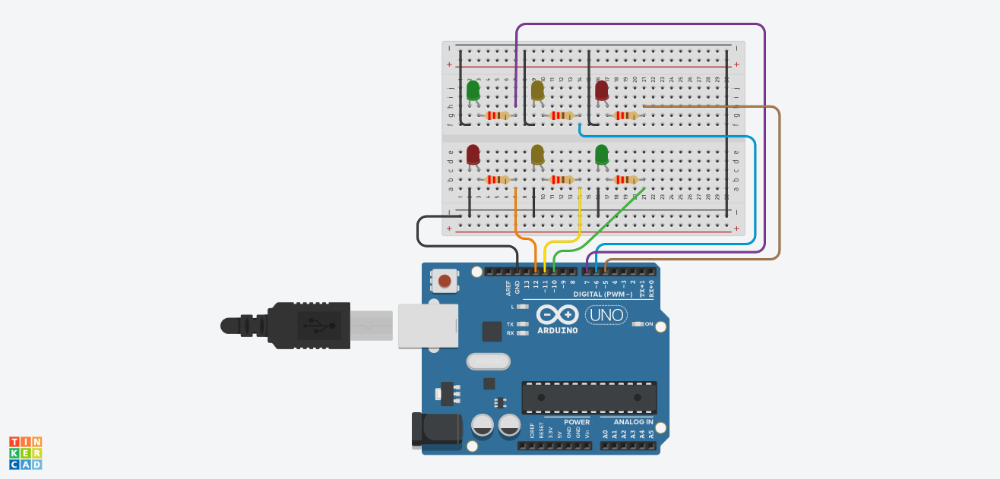

# Meu Primeiro Projeto Arduino com Tinkercad 🚀

Este é o meu primeiro projeto utilizando Arduino, desenvolvido e simulado na plataforma Tinkercad.

## 📋 Descrição
Um sistema de semáforo simples que alterna as luzes LED usando temporizadores.

## 🛠️ Componentes Utilizados
* 1x Arduino Uno R3
* 1x Protoboard
* 6 x Resistoresd de 220 Ω "R1, R2, R3, R4, R5, R6"
* 2 x Leds Verdes
* 2 x Leds Amarelos
* 2 x Leds Vermelhos
* 

## ⚡ O Circuito

## 🔗 Simulação Online
Você pode visualizar e testar o projeto diretamente no Tinkercad através do link:
[Cole aqui o link de compartilhamento público do seu Tinkercad]
